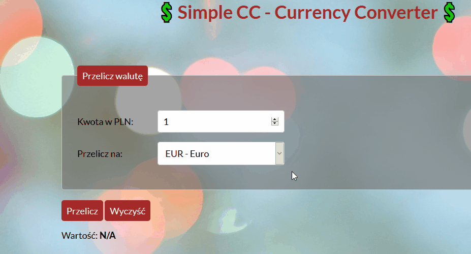

# Simple-Currency-Converter

https://k1s1el.github.io/Simple-Currency-Converter/

## Hello!

Welcome to my Simple Currency Converter.
Here you can calculate exchange from PLN to few other currencies (EUR, USD, GBP).
This is a simple HTML form controlled by the JavaScript.
In first field you enter a value in PLN and in second field you choose currency.
Result is shown in the bottom of the form. Exchange rates are coded in JS. 
I used switch function for calculating result.

This is the first version of this project. In future I will add more currencies and functionalities.

## Demo

## Technologies used:

1. HTML
2. CSS according to BEM
3. JavaScript

Thank you and best regards,

MK
